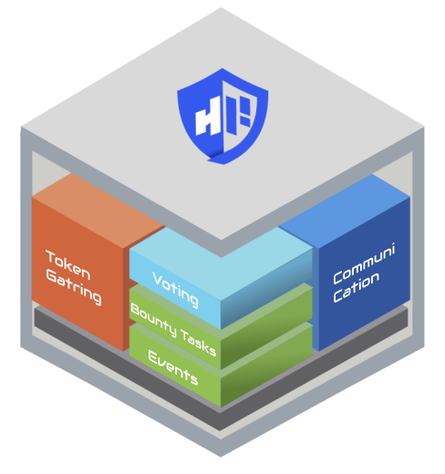
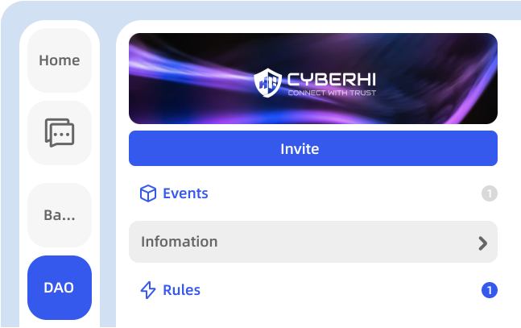
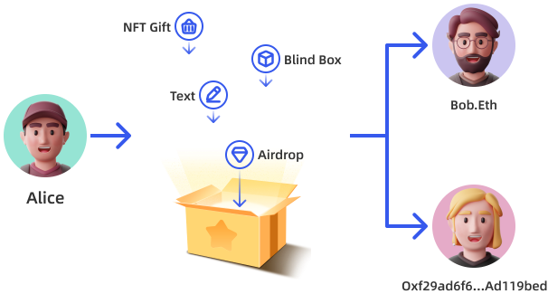
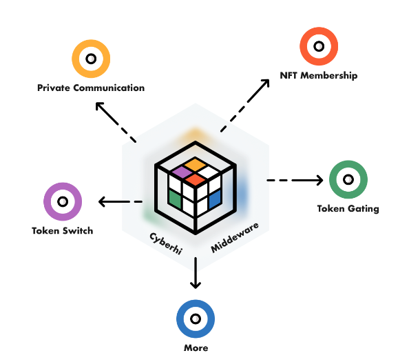

# Team Name

CyberHiLab Team

# Job Allocation

Team Leader

# Project Intro:

## Intro

CyberHi is an NFT-based Discord-Like Community Platform.We are trying to build a platform to run Web3 Community easily. It has four main features:

## Web3 Social Platform

CyberHi provides a full-stack platform and tools to launch and run web3-based communities.No technical experience required.At the same time, it provides convenient token payment to allow community members to better support their favorite communities.

## Smart Composable Message

The smart composable message allows the message to extend from text and voice to complicated signed messages: such as Ask, Bid, NFT Card, Airdrop and so on. Make message flow become more efficient and safe.

## Social Middleware

CyberHi's social capabilities and various components can be empowered to other wallets and DApps through Widgets, APIs, etc., to jointly build Web3 social relationships. CyberHi will also integrate industry-leading products to provide the best experience

## CyberHi-Matrix

A distributed web3 social and communication network built with CyberHi nodes.

## Resource

[Home Website](https://www.cyberhi.live)

[CyberHi DApp](https://dao.cyberhi.live)

The core features

# Video Link:

https://youtu.be/ITA0QARBppc

# Repository Addr:

https://github.com/orgs/CyberHiLab/

# Contract Addr:

CyberHIMember Contract:0xe180dD17Fdb0a95D428FAA94E335eb8745398bFA
